# Quant Research OS

Autonomous AI quantitative research laboratory.

**Hard rule:** Deterministic engines are the sole source of truth for financial metrics.
The current research planner is a **deterministic template** (not an LLM call). Optional LangGraph/OpenAI deps are reserved for a future agent mode.

```mermaid
flowchart LR
    Question[Research question] --> Orchestrator[Research orchestrator]
    Orchestrator --> Agents[Planner, data, hypothesis, validation, risk agents]
    Agents --> Tools[Allowlisted research tools]
    Tools --> Engine[Deterministic backtest and portfolio engine]
    Engine --> Evidence[Experiments, lineage, and reports]
    Evidence --> Review[Robustness and risk veto]
    Review --> Decision[Promote, reject, or mark inconclusive]
```



## Status

Phases **0–10** implemented in this package:

| Phase | Capability |
|---|---|
| 0 | Architecture assessment |
| 1 | Domain models, CS backtest (lagged), costs, data quality, synthetic FX |
| 2 | Experiment registry, config hashes, lineage |
| 3 | Alpha library + diversification analysis |
| 4 | Allowlisted tools + deterministic research agents |
| 5 | Walk-forward, bootstrap, robustness, regimes, adversarial review |
| 6 | Portfolio allocation + stress / risk veto |
| 7 | Autonomous research orchestrator + budgets + memory |
| 8 | Document ingest + event extraction (must still be backtested) |
| 9 | Paper trading + degradation monitoring |
| 10 | FastAPI + CLI + research dashboard |

## Quick start

```bash
cd "/Users/kaiwenmei/Desktop/x11/trading operating system"
python3.11 -m venv .venv
source .venv/bin/activate
pip install -e ".[dev]"
pytest
```

### Flagship research run

```bash
quant research run "Find a robust cross-sectional FX strategy with low correlation to my existing momentum strategies."
```

### API + workstation UI

```bash
# Terminal 1 — API
quant serve --host 127.0.0.1 --port 8002

# Terminal 2 — Research workstation (Next.js)
cd web && npm install && npm run dev
# open http://127.0.0.1:3012
```

## Documentation

- `docs/UI_WORKSTATION.md` — workstation stages
- `docs/Quant_Research_OS_Handbook.pdf` — bilingual technical handbook (English left / 中文 right; architecture, theory, diagrams, code walkthrough)
- Generate/update handbook: `python docs/generate_handbook_pdf.py`

## Architecture

```
User / CLI / Web
      ↓
Research Orchestrator (explicit state machine)
      ↓
Agents (planner, data, hypothesis, validation, adversarial, risk)
      ↓
Allowlisted Tool Layer
      ↓
Deterministic Quant Engine (backtest, WF, stats, portfolio)
      ↓
SQLite research DB + Alpha library + Reports
```

Sibling `portfolio-agent` metrics are reused when available via adapter.

## Safety

- No live trading tools
- No arbitrary shell execution for agents
- Alpha metrics require tool provenance IDs
- Research budgets prevent infinite loops
- Rejection / inconclusive are first-class outcomes
